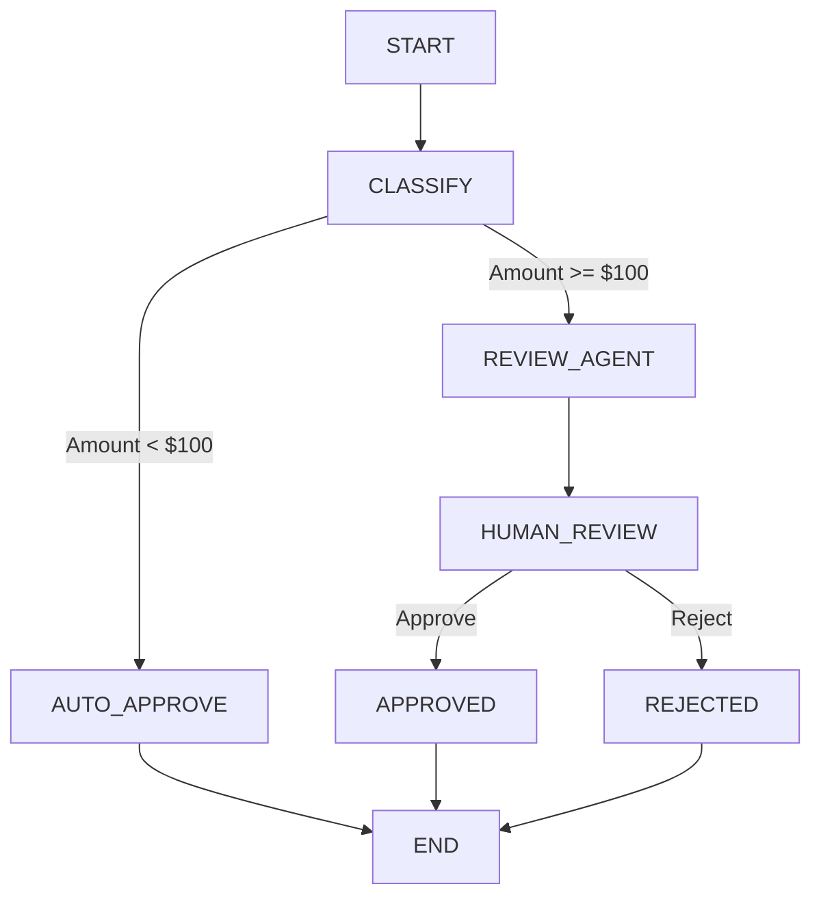

# 🚀 Ambient Expense Agent

### Intelligent Expense Approval Workflow with Human-in-the-Loop Using Google ADK 2.0

Built as part of **Kaggle's 5-Day AI Agents: Intensive Vibe Coding Course with Google**, this project demonstrates how to build production-style AI workflows using **Google Agent Development Kit (ADK) 2.0**, incorporating **Human-in-the-Loop (HITL)** decision-making, workflow orchestration, and persistent session management.

---

## 🌟 Overview

Organizations process thousands of expense claims every month. Many expenses can be approved automatically based on predefined business rules, while larger or unusual expenses require manual review.

The **Ambient Expense Agent** automates this process by intelligently routing expense requests through a graph-based workflow:

* Small expenses are approved automatically.
* Large expenses are escalated for human review.
* Workflows pause and resume seamlessly using ADK's Human-in-the-Loop capabilities.
* Session state is preserved throughout the approval lifecycle.

This project showcases how modern AI agents can orchestrate real-world business processes while maintaining human oversight when necessary.

---

## 🎯 Key Features

* ✅ Built with Google ADK 2.0 Workflow API
* ✅ Graph-Based Agent Architecture
* ✅ Human-in-the-Loop (HITL) Approval Flow
* ✅ Stateful Workflow Execution
* ✅ Session Persistence & Rehydration
* ✅ Dynamic Expense Classification
* ✅ Automatic Approval Rules
* ✅ Manual Approval & Rejection Process
* ✅ Workflow Interruption using RequestInput
* ✅ ADK Playground Integration
* ✅ Production-Oriented Agent Design

---

# 🏗️ System Architecture



---

# 🔄 Workflow Execution

The workflow follows a simple but powerful approval strategy:

### Step 1: Expense Submission

A user submits an expense report:

```json
{
  "amount": 150,
  "submitter": "alice@company.com",
  "category": "software",
  "description": "IDE License"
}
```

---

### Step 2: Classification

The workflow evaluates the expense amount.

| Amount          | Action                |
| --------------- | --------------------- |
| Less than $100  | Auto Approve          |
| $100 or Greater | Human Review Required |

---

### Step 3: Approval Routing

#### Auto Approval

If the amount is below the threshold:

```json
{
  "status": "Approved",
  "reason": "Expense of $80.00 automatically approved."
}
```

---

#### Human Review

For higher-value expenses:

```json
{
  "amount": 150
}
```

The workflow pauses execution and waits for reviewer input.

Available actions:

* Approve
* Reject

---

### Step 4: Workflow Resumption

Once the reviewer responds:

* Session state is restored
* Workflow continues from the pause point
* Final decision is recorded

---

# 📂 Project Structure

```text
expense-agent/
│
├── app/
│   ├── agent.py
│   ├── agent_runtime_app.py
│
├── deployment/
│   └── terraform/
│
├── tests/
│
├── pyproject.toml
├── uv.lock
├── agents-cli-manifest.yaml
└── README.md
```

---

# 🛠️ Technology Stack

| Category           | Technology           |
| ------------------ | -------------------- |
| AI Framework       | Google ADK 2.0       |
| Workflow Engine    | ADK Workflow API     |
| Language           | Python 3.11+         |
| Dependency Manager | UV                   |
| Data Validation    | Pydantic             |
| Human Review       | RequestInput         |
| Local Testing      | ADK Playground       |
| Runtime            | Vertex AI Compatible |

---

# ⚙️ Installation

## Prerequisites

Before getting started, ensure the following tools are installed:

* Python 3.11+
* UV Package Manager
* Google ADK
* Agents CLI
* Google AI Studio API Key

---

## 1️⃣ Clone the Repository

```bash
git clone https://github.com/your-username/ambient-expense-agent.git

cd ambient-expense-agent
```

---

## 2️⃣ Install Dependencies

Using UV:

```bash
uv sync
```

This will install all project dependencies defined in:

```text
pyproject.toml
```

---

## 3️⃣ Configure Environment Variables

Create a `.env` file:

```env
GOOGLE_API_KEY=YOUR_GOOGLE_AI_STUDIO_API_KEY
```

Generate an API key from:

https://aistudio.google.com/app/apikey

---

## 4️⃣ Configure Agents CLI

Initialize the local development environment:

```bash
uvx google-agents-cli setup
```

Verify installation:

```bash
agents-cli info
```

---

# 🚀 Running the Agent

## Launch ADK Playground

Start the development server:

```bash
agents-cli playground
```

---

## Open Playground

Navigate to:

```text
http://127.0.0.1:8000/dev-ui
```

You can now interact with the expense approval workflow through the ADK Playground UI.

---

# 🧪 Test Scenarios

## Test Case 1 – Auto Approval

### Input

```json
{
  "amount": 45,
  "submitter": "bob@company.com",
  "category": "food",
  "description": "Team Lunch"
}
```

### Expected Result

```text
Approved Automatically
```

---

## Test Case 2 – Boundary Condition

### Input

```json
{
  "amount": 99
}
```

### Expected Result

```text
Approved Automatically
```

---

## Test Case 3 – Human Review

### Input

```json
{
  "amount": 150,
  "submitter": "alice@company.com",
  "category": "software",
  "description": "IDE License"
}
```

### Expected Result

```text
Workflow Pauses
Human Approval Requested
```

---

## Test Case 4 – High-Value Expense

### Input

```json
{
  "amount": 5000,
  "submitter": "manager@company.com",
  "category": "travel",
  "description": "International Business Flight"
}
```

### Expected Result

```text
Manual Review Required
```

---

# 📸 Screenshots

## ADK Playground

```text
screenshots/adk-playground.png
```

---

## Workflow Graph

```text
screenshots/workflow-graph.png
```

---

## Auto Approval Example

```text
screenshots/auto-approval.png
```

---

## Human Review Flow

```text
screenshots/human-review.png
```

---

## Approval Result

```text
screenshots/approval-result.png
```

---

## Rejection Result

```text
screenshots/rejection-result.png
```

---

# 🎓 Learning Outcomes

This project provided hands-on experience with:

* Google Agent Development Kit (ADK 2.0)
* Workflow-Based Agent Systems
* Graph-Oriented Agent Design
* Human-in-the-Loop Architectures
* Stateful Agent Workflows
* Session Persistence & Recovery
* RequestInput Workflow Interruptions
* Production-Oriented AI Engineering
* Vertex AI Compatible Agent Development

---

# 🔮 Future Enhancements

Potential improvements include:

* Multi-Level Approval Chains
* Expense Policy Engine
* Email Notifications
* Slack Integration
* Role-Based Reviewer Assignment
* Audit Logging
* Database Persistence
* Dashboard Analytics
* Fraud Detection Workflows
* ERP Integration

---

# 📚 References

* Google Agent Development Kit (ADK)
* Google AI Studio
* Agents CLI
* Vertex AI Agent Runtime
* Kaggle 5-Day AI Agents Intensive Vibe Coding Course

---

# 🙌 Acknowledgements

Special thanks to:

* Google
* Google Cloud
* Kaggle
* Google AI Developer Team

for providing the tools, infrastructure, and educational resources that made this project possible.

---

# ⭐ Support

If you found this project useful, please consider:

⭐ Starring the repository

🍴 Forking the project

🤝 Contributing improvements

📢 Sharing feedback

---

## 👨‍💻 Author

**Deep Pakhare**

AI Engineer • Agentic AI Enthusiast • Google ADK Learner

Built with ❤️ using Google ADK 2.0 and Gemini.
